# 老年公寓管理系统 - 数据库设计文档

## 1. 数据库概述

本系统采用MySQL 8.0作为数据库管理系统，设计了一套完整的数据库结构，用于存储老年公寓管理系统的所有数据。数据库设计遵循了关系型数据库的设计原则，包括实体完整性、参照完整性和用户定义完整性。

## 2. 实体关系图(ER图)

使用Mermaid语法绘制的ER图：

```mermaid
erDiagram
    USER ||--o{ USER_ROLE : "has"
    ROLE ||--o{ USER_ROLE : "assigned to"
    ROLE ||--o{ ROLE_PERMISSION : "has"
    PERMISSION ||--o{ ROLE_PERMISSION : "assigned to"
    ELDERLY ||--o{ HEALTH_ARCHIVE : "has"
    ELDERLY ||--o{ HEALTH_RECORD : "has"
    ELDERLY ||--o{ CARE_PLAN : "has"
    ELDERLY ||--o{ CARE_RECORD : "has"
    ELDERLY ||--o{ MEDICINE_RECORD : "has"
    ELDERLY ||--o{ ACTIVITY_SIGNUP : "participates in"
    ELDERLY ||--o{ FEE_RECORD : "has"
    ELDERLY ||--o{ ACCESS_RECORD : "has"
    ELDERLY ||--o{ ELDERLY_MEAL_PLAN : "participates in"
    ROOM ||--o{ ELDERLY : "houses"
    MEAL_PLAN ||--o{ ELDERLY_MEAL_PLAN : "includes"
    CARE_PLAN ||--o{ CARE_RECORD : "executed in"
    USER ||--o{ CARE_RECORD : "created by"
    USER ||--o{ ACCESS_RECORD : "recorded by"
    USER ||--o{ NURSE_SCHEDULE : "assigned to"
    USER ||--o{ ACTIVITY_SIGNUP : "approved by"
    HEALTH_ARCHIVE ||--o{ HEALTH_RECORD : "includes"
    HEALTH_ARCHIVE ||--o{ CARE_PLAN : "linked to"
    MEDICINE_INVENTORY ||--o{ MEDICINE_RECORD : "dispensed from"
    MEDICINE_INVENTORY ||--o{ MEDICINE_APPROVAL : "requires"
    ACTIVITY ||--o{ ACTIVITY_SIGNUP : "has"
    ACTIVITY ||--o{ ACTIVITY_FEEDBACK : "receives"
    NURSE_SCHEDULE ||--o{ CARE_RECORD : "related to"

    USER {
        int id PK
        string username
        string password
        string real_name
        string phone
        string email
        string status
        datetime create_time
        datetime update_time
    }

    ROLE {
        int id PK
        string name
        string code
        string description
        datetime create_time
        datetime update_time
    }

    PERMISSION {
        int id PK
        string name
        string code
        string url
        string method
        datetime create_time
        datetime update_time
    }

    USER_ROLE {
        int user_id PK, FK
        int role_id PK, FK
    }

    ROLE_PERMISSION {
        int role_id PK, FK
        int permission_id PK, FK
    }

    ELDERLY {
        int id PK
        string name
        string gender
        date birthday
        string id_card
        string phone
        string address
        string health_status
        string emergency_contact
        string emergency_phone
        int room_id FK
        datetime check_in_time
        datetime check_out_time
        string status
        datetime create_time
        datetime update_time
    }

    ROOM {
        int id PK
        string room_number
        string type
        int capacity
        int current_occupancy
        string status
        decimal price
        datetime create_time
        datetime update_time
    }

    HEALTH_DATA {
        int id PK
        int elderly_id FK
        decimal blood_pressure
        decimal heart_rate
        decimal body_temperature
        decimal blood_sugar
        string health_note
        datetime record_time
        datetime create_time
    }

    CARE_PLAN {
        int id PK
        int elderly_id FK
        string title
        string content
        date start_date
        date end_date
        string status
        datetime create_time
        datetime update_time
    }

    CARE_RECORD {
        int id PK
        int elderly_id FK
        int care_plan_id FK
        int user_id FK
        string content
        string status
        datetime execute_time
        datetime create_time
    }

    MEAL_PLAN {
        int id PK
        string name
        date plan_date
        string breakfast
        string lunch
        string dinner
        string snack
        datetime create_time
        datetime update_time
    }

    ELDERLY_MEAL_PLAN {
        int elderly_id PK, FK
        int meal_plan_id PK, FK
        string special_requirement
        datetime create_time
    }

    FEE_RECORD {
        int id PK
        int elderly_id FK
        string fee_type
        decimal amount
        string payment_status
        date due_date
        date payment_date
        string payment_method
        datetime create_time
        datetime update_time
    }

    ACCESS_RECORD {
        int id PK
        int elderly_id FK
        int user_id FK
        string access_type
        string access_location
        datetime access_time
        string description
        datetime create_time
    }

    HEALTH_ARCHIVE {
        int id PK
        int elderly_id FK
        string medical_history
        string chronic_disease
        string allergy_info
        string medication_history
        string blood_type
        string height
        decimal weight
        string checkup_report
        string emergency_medicine
        string notes
        datetime create_time
        datetime update_time
    }

    HEALTH_RECORD {
        int id PK
        int health_archive_id FK
        string record_type
        string blood_pressure
        int heart_rate
        decimal body_temperature
        decimal blood_sugar
        string spo2
        string weight
        string description
        string attachment
        datetime record_time
        datetime create_time
    }

    NURSE_SCHEDULE {
        int id PK
        int user_id FK
        int elderly_id FK
        date schedule_date
        time start_time
        time end_time
        string shift_type
        string task_content
        string status
        datetime create_time
        datetime update_time
    }

    MEDICINE_INVENTORY {
        int id PK
        string medicine_name
        string medicine_code
        string specification
        string manufacturer
        decimal unit_price
        int current_stock
        int min_stock
        string unit
        date expiry_date
        string storage_location
        string status
        datetime create_time
        datetime update_time
    }

    MEDICINE_RECORD {
        int id PK
        int elderly_id FK
        int medicine_id FK
        int user_id FK
        string medicine_name
        decimal dosage
        string dosage_unit
        string frequency
        string administration_route
        datetime medication_time
        string notes
        datetime create_time
    }

    MEDICINE_APPROVAL {
        int id PK
        int elderly_id FK
        int medicine_id FK
        int user_id FK
        string medicine_name
        decimal dosage
        string dosage_unit
        string frequency
        string reason
        string status
        datetime approval_time
        int approver_id FK
        datetime create_time
        datetime update_time
    }

    ACTIVITY {
        int id PK
        string activity_name
        string activity_type
        string description
        date activity_date
        time start_time
        time end_time
        string location
        int max_participants
        int current_participants
        string organizer
        string status
        datetime create_time
        datetime update_time
    }

    ACTIVITY_SIGNUP {
        int id PK
        int activity_id FK
        int elderly_id FK
        int approver_id FK
        datetime signup_time
        string status
        string notes
        datetime create_time
        datetime update_time
    }

    ACTIVITY_FEEDBACK {
        int id PK
        int activity_id FK
        int elderly_id FK
        string feedback_content
        int rating
        string suggestion
        datetime feedback_time
        datetime create_time
    }
```

## 3. 表结构设计

### 3.1 用户表(user)

| 字段名 | 数据类型 | 约束 | 描述 |
|--------|----------|------|------|
| id | int | PRIMARY KEY, AUTO_INCREMENT | 用户ID |
| username | varchar(50) | UNIQUE, NOT NULL | 用户名 |
| password | varchar(255) | NOT NULL | 密码（加密存储） |
| real_name | varchar(50) | NOT NULL | 真实姓名 |
| phone | varchar(20) | NOT NULL | 手机号码 |
| email | varchar(100) | | 邮箱 |
| status | tinyint | NOT NULL DEFAULT 1 | 状态（1:启用，0:禁用） |
| create_time | datetime | NOT NULL DEFAULT CURRENT_TIMESTAMP | 创建时间 |
| update_time | datetime | NOT NULL DEFAULT CURRENT_TIMESTAMP ON UPDATE CURRENT_TIMESTAMP | 更新时间 |

### 3.2 角色表(role)

| 字段名 | 数据类型 | 约束 | 描述 |
|--------|----------|------|------|
| id | int | PRIMARY KEY, AUTO_INCREMENT | 角色ID |
| name | varchar(50) | NOT NULL | 角色名称 |
| code | varchar(50) | UNIQUE, NOT NULL | 角色编码 |
| description | varchar(255) | | 角色描述 |
| create_time | datetime | NOT NULL DEFAULT CURRENT_TIMESTAMP | 创建时间 |
| update_time | datetime | NOT NULL DEFAULT CURRENT_TIMESTAMP ON UPDATE CURRENT_TIMESTAMP | 更新时间 |

### 3.3 权限表(permission)

| 字段名 | 数据类型 | 约束 | 描述 |
|--------|----------|------|------|
| id | int | PRIMARY KEY, AUTO_INCREMENT | 权限ID |
| name | varchar(50) | NOT NULL | 权限名称 |
| code | varchar(50) | UNIQUE, NOT NULL | 权限编码 |
| url | varchar(255) | NOT NULL | 权限URL |
| method | varchar(10) | NOT NULL | 请求方法（GET, POST, PUT, DELETE等） |
| create_time | datetime | NOT NULL DEFAULT CURRENT_TIMESTAMP | 创建时间 |
| update_time | datetime | NOT NULL DEFAULT CURRENT_TIMESTAMP ON UPDATE CURRENT_TIMESTAMP | 更新时间 |

### 3.4 用户角色关联表(user_role)

| 字段名 | 数据类型 | 约束 | 描述 |
|--------|----------|------|------|
| user_id | int | PRIMARY KEY, FOREIGN KEY REFERENCES user(id) | 用户ID |
| role_id | int | PRIMARY KEY, FOREIGN KEY REFERENCES role(id) | 角色ID |

### 3.5 角色权限关联表(role_permission)

| 字段名 | 数据类型 | 约束 | 描述 |
|--------|----------|------|------|
| role_id | int | PRIMARY KEY, FOREIGN KEY REFERENCES role(id) | 角色ID |
| permission_id | int | PRIMARY KEY, FOREIGN KEY REFERENCES permission(id) | 权限ID |

### 3.6 老年人表(elderly)

| 字段名 | 数据类型 | 约束 | 描述 |
|--------|----------|------|------|
| id | int | PRIMARY KEY, AUTO_INCREMENT | 老年人ID |
| name | varchar(50) | NOT NULL | 姓名 |
| gender | tinyint | NOT NULL | 性别（1:男，2:女） |
| birthday | date | NOT NULL | 出生日期 |
| id_card | varchar(18) | UNIQUE, NOT NULL | 身份证号码 |
| phone | varchar(20) | | 手机号码 |
| address | varchar(255) | | 地址 |
| health_status | varchar(255) | | 健康状况 |
| emergency_contact | varchar(50) | NOT NULL | 紧急联系人 |
| emergency_phone | varchar(20) | NOT NULL | 紧急联系电话 |
| room_id | int | FOREIGN KEY REFERENCES room(id) | 房间ID |
| check_in_time | datetime | | 入住时间 |
| check_out_time | datetime | | 退房时间 |
| status | tinyint | NOT NULL DEFAULT 1 | 状态（1:在住，2:已退房，3:请假） |
| create_time | datetime | NOT NULL DEFAULT CURRENT_TIMESTAMP | 创建时间 |
| update_time | datetime | NOT NULL DEFAULT CURRENT_TIMESTAMP ON UPDATE CURRENT_TIMESTAMP | 更新时间 |

### 3.7 房间表(room)

| 字段名 | 数据类型 | 约束 | 描述 |
|--------|----------|------|------|
| id | int | PRIMARY KEY, AUTO_INCREMENT | 房间ID |
| room_number | varchar(20) | UNIQUE, NOT NULL | 房间号 |
| type | tinyint | NOT NULL | 房间类型（1:单人间，2:双人间，3:套房） |
| capacity | int | NOT NULL | 房间容量 |
| current_occupancy | int | NOT NULL DEFAULT 0 | 当前入住人数 |
| status | tinyint | NOT NULL DEFAULT 1 | 状态（1:可用，2:已入住，3:维修中，4:已预订） |
| price | decimal(10,2) | NOT NULL | 房间价格 |
| create_time | datetime | NOT NULL DEFAULT CURRENT_TIMESTAMP | 创建时间 |
| update_time | datetime | NOT NULL DEFAULT CURRENT_TIMESTAMP ON UPDATE CURRENT_TIMESTAMP | 更新时间 |

### 3.8 健康数据表(health_data)

| 字段名 | 数据类型 | 约束 | 描述 |
|--------|----------|------|------|
| id | int | PRIMARY KEY, AUTO_INCREMENT | 健康数据ID |
| elderly_id | int | FOREIGN KEY REFERENCES elderly(id) | 老年人ID |
| blood_pressure | varchar(20) | | 血压 |
| heart_rate | int | | 心率 |
| body_temperature | decimal(5,2) | | 体温 |
| blood_sugar | decimal(5,2) | | 血糖 |
| health_note | text | | 健康备注 |
| record_time | datetime | NOT NULL | 记录时间 |
| create_time | datetime | NOT NULL DEFAULT CURRENT_TIMESTAMP | 创建时间 |

### 3.9 护理计划表(care_plan)

| 字段名 | 数据类型 | 约束 | 描述 |
|--------|----------|------|------|
| id | int | PRIMARY KEY, AUTO_INCREMENT | 护理计划ID |
| elderly_id | int | FOREIGN KEY REFERENCES elderly(id) | 老年人ID |
| title | varchar(100) | NOT NULL | 计划标题 |
| content | text | NOT NULL | 计划内容 |
| start_date | date | NOT NULL | 开始日期 |
| end_date | date | NOT NULL | 结束日期 |
| status | tinyint | NOT NULL DEFAULT 1 | 状态（1:未开始，2:进行中，3:已完成，4:已取消） |
| create_time | datetime | NOT NULL DEFAULT CURRENT_TIMESTAMP | 创建时间 |
| update_time | datetime | NOT NULL DEFAULT CURRENT_TIMESTAMP ON UPDATE CURRENT_TIMESTAMP | 更新时间 |

### 3.10 护理记录表(care_record)

| 字段名 | 数据类型 | 约束 | 描述 |
|--------|----------|------|------|
| id | int | PRIMARY KEY, AUTO_INCREMENT | 护理记录ID |
| elderly_id | int | FOREIGN KEY REFERENCES elderly(id) | 老年人ID |
| care_plan_id | int | FOREIGN KEY REFERENCES care_plan(id) | 护理计划ID |
| user_id | int | FOREIGN KEY REFERENCES user(id) | 护理人员ID |
| content | text | NOT NULL | 护理内容 |
| status | tinyint | NOT NULL DEFAULT 1 | 状态（1:已完成，2:未完成） |
| execute_time | datetime | NOT NULL | 执行时间 |
| create_time | datetime | NOT NULL DEFAULT CURRENT_TIMESTAMP | 创建时间 |

### 3.11 餐饮计划表(meal_plan)

| 字段名 | 数据类型 | 约束 | 描述 |
|--------|----------|------|------|
| id | int | PRIMARY KEY, AUTO_INCREMENT | 餐饮计划ID |
| name | varchar(100) | NOT NULL | 计划名称 |
| plan_date | date | NOT NULL | 计划日期 |
| breakfast | text | NOT NULL | 早餐 |
| lunch | text | NOT NULL | 午餐 |
| dinner | text | NOT NULL | 晚餐 |
| snack | text | | 点心 |
| create_time | datetime | NOT NULL DEFAULT CURRENT_TIMESTAMP | 创建时间 |
| update_time | datetime | NOT NULL DEFAULT CURRENT_TIMESTAMP ON UPDATE CURRENT_TIMESTAMP | 更新时间 |

### 3.12 老年人餐饮计划关联表(elderly_meal_plan)

| 字段名 | 数据类型 | 约束 | 描述 |
|--------|----------|------|------|
| elderly_id | int | PRIMARY KEY, FOREIGN KEY REFERENCES elderly(id) | 老年人ID |
| meal_plan_id | int | PRIMARY KEY, FOREIGN KEY REFERENCES meal_plan(id) | 餐饮计划ID |
| special_requirement | text | | 特殊饮食需求 |
| create_time | datetime | NOT NULL DEFAULT CURRENT_TIMESTAMP | 创建时间 |

### 3.13 费用记录表(fee_record)

| 字段名 | 数据类型 | 约束 | 描述 |
|--------|----------|------|------|
| id | int | PRIMARY KEY, AUTO_INCREMENT | 费用记录ID |
| elderly_id | int | FOREIGN KEY REFERENCES elderly(id) | 老年人ID |
| fee_type | tinyint | NOT NULL | 费用类型（1:住宿费，2:护理费，3:餐饮费，4:水电费，5:其他费用） |
| amount | decimal(10,2) | NOT NULL | 金额 |
| payment_status | tinyint | NOT NULL DEFAULT 1 | 支付状态（1:未支付，2:已支付，3:部分支付） |
| due_date | date | NOT NULL | 到期日期 |
| payment_date | datetime | | 支付日期 |
| payment_method | tinyint | | 支付方式（1:现金，2:银行转账，3:微信支付，4:支付宝支付） |
| create_time | datetime | NOT NULL DEFAULT CURRENT_TIMESTAMP | 创建时间 |
| update_time | datetime | NOT NULL DEFAULT CURRENT_TIMESTAMP ON UPDATE CURRENT_TIMESTAMP | 更新时间 |

### 3.14 出入记录表(access_record)

| 字段名 | 数据类型 | 约束 | 描述 |
|--------|----------|------|------|
| id | int | PRIMARY KEY, AUTO_INCREMENT | 出入记录ID |
| elderly_id | int | FOREIGN KEY REFERENCES elderly(id) | 老年人ID |
| user_id | int | FOREIGN KEY REFERENCES user(id) | 记录人ID |
| access_type | tinyint | NOT NULL | 出入类型（1:进入，2:离开） |
| access_location | varchar(100) | NOT NULL | 出入地点 |
| access_time | datetime | NOT NULL | 出入时间 |
| description | varchar(255) | | 备注 |
| create_time | datetime | NOT NULL DEFAULT CURRENT_TIMESTAMP | 创建时间 |

### 3.15 健康档案表(health_archive)

| 字段名 | 数据类型 | 约束 | 描述 |
|--------|----------|------|------|
| id | int | PRIMARY KEY, AUTO_INCREMENT | 健康档案ID |
| elderly_id | int | FOREIGN KEY REFERENCES elderly(id) | 老年人ID |
| medical_history | text | | 病史 |
| chronic_disease | text | | 慢性病 |
| allergy_info | text | | 过敏信息 |
| medication_history | text | | 用药历史 |
| blood_type | varchar(10) | | 血型 |
| height | decimal(5,2) | | 身高(cm) |
| weight | decimal(5,2) | | 体重(kg) |
| checkup_report | varchar(255) | | 体检报告文件路径 |
| emergency_medicine | text | | 紧急用药 |
| notes | text | | 备注 |
| create_time | datetime | NOT NULL DEFAULT CURRENT_TIMESTAMP | 创建时间 |
| update_time | datetime | NOT NULL DEFAULT CURRENT_TIMESTAMP ON UPDATE CURRENT_TIMESTAMP | 更新时间 |

### 3.16 健康记录表(health_record)

| 字段名 | 数据类型 | 约束 | 描述 |
|--------|----------|------|------|
| id | int | PRIMARY KEY, AUTO_INCREMENT | 健康记录ID |
| health_archive_id | int | FOREIGN KEY REFERENCES health_archive(id) | 健康档案ID |
| record_type | varchar(50) | NOT NULL | 记录类型 |
| blood_pressure | varchar(20) | | 血压 |
| heart_rate | int | | 心率 |
| body_temperature | decimal(5,2) | | 体温 |
| blood_sugar | decimal(5,2) | | 血糖 |
| spo2 | int | | 血氧饱和度 |
| weight | decimal(5,2) | | 体重 |
| description | text | | 描述 |
| attachment | varchar(255) | | 附件文件路径 |
| record_time | datetime | NOT NULL | 记录时间 |
| create_time | datetime | NOT NULL DEFAULT CURRENT_TIMESTAMP | 创建时间 |

### 3.17 护理排班表(nurse_schedule)

| 字段名 | 数据类型 | 约束 | 描述 |
|--------|----------|------|------|
| id | int | PRIMARY KEY, AUTO_INCREMENT | 排班ID |
| user_id | int | FOREIGN KEY REFERENCES user(id) | 护理人员ID |
| elderly_id | int | FOREIGN KEY REFERENCES elderly(id) | 老年人ID |
| schedule_date | date | NOT NULL | 排班日期 |
| start_time | time | NOT NULL | 开始时间 |
| end_time | time | NOT NULL | 结束时间 |
| shift_type | varchar(20) | NOT NULL | 班次类型（早班、中班、晚班） |
| task_content | text | | 任务内容 |
| status | tinyint | NOT NULL DEFAULT 1 | 状态（1:待执行，2:执行中，3:已完成，4:已取消） |
| create_time | datetime | NOT NULL DEFAULT CURRENT_TIMESTAMP | 创建时间 |
| update_time | datetime | NOT NULL DEFAULT CURRENT_TIMESTAMP ON UPDATE CURRENT_TIMESTAMP | 更新时间 |

### 3.18 药品库存表(medicine_inventory)

| 字段名 | 数据类型 | 约束 | 描述 |
|--------|----------|------|------|
| id | int | PRIMARY KEY, AUTO_INCREMENT | 药品ID |
| medicine_name | varchar(100) | NOT NULL | 药品名称 |
| medicine_code | varchar(50) | UNIQUE | 药品编码 |
| specification | varchar(100) | | 规格 |
| manufacturer | varchar(100) | | 生产厂家 |
| unit_price | decimal(10,2) | | 单价 |
| current_stock | int | NOT NULL DEFAULT 0 | 当前库存 |
| min_stock | int | NOT NULL DEFAULT 10 | 最低库存 |
| unit | varchar(20) | | 单位 |
| expiry_date | date | | 有效期 |
| storage_location | varchar(100) | | 存放位置 |
| status | tinyint | NOT NULL DEFAULT 1 | 状态（1:正常，2:库存不足，3:已过期，4:已停用） |
| create_time | datetime | NOT NULL DEFAULT CURRENT_TIMESTAMP | 创建时间 |
| update_time | datetime | NOT NULL DEFAULT CURRENT_TIMESTAMP ON UPDATE CURRENT_TIMESTAMP | 更新时间 |

### 3.19 用药记录表(medicine_record)

| 字段名 | 数据类型 | 约束 | 描述 |
|--------|----------|------|------|
| id | int | PRIMARY KEY, AUTO_INCREMENT | 用药记录ID |
| elderly_id | int | FOREIGN KEY REFERENCES elderly(id) | 老年人ID |
| medicine_id | int | FOREIGN KEY REFERENCES medicine_inventory(id) | 药品ID |
| user_id | int | FOREIGN KEY REFERENCES user(id) | 发药人员ID |
| medicine_name | varchar(100) | NOT NULL | 药品名称 |
| dosage | decimal(10,2) | NOT NULL | 用量 |
| dosage_unit | varchar(20) | | 用量单位 |
| frequency | varchar(50) | | 用药频率 |
| administration_route | varchar(50) | | 给药途径 |
| medication_time | datetime | NOT NULL | 用药时间 |
| notes | text | | 备注 |
| create_time | datetime | NOT NULL DEFAULT CURRENT_TIMESTAMP | 创建时间 |

### 3.20 药品审批表(medicine_approval)

| 字段名 | 数据类型 | 约束 | 描述 |
|--------|----------|------|------|
| id | int | PRIMARY KEY, AUTO_INCREMENT | 审批ID |
| elderly_id | int | FOREIGN KEY REFERENCES elderly(id) | 老年人ID |
| medicine_id | int | FOREIGN KEY REFERENCES medicine_inventory(id) | 药品ID |
| user_id | int | FOREIGN KEY REFERENCES user(id) | 申请人ID |
| medicine_name | varchar(100) | NOT NULL | 药品名称 |
| dosage | decimal(10,2) | NOT NULL | 用量 |
| dosage_unit | varchar(20) | | 用量单位 |
| frequency | varchar(50) | | 用药频率 |
| reason | text | | 申请原因 |
| status | tinyint | NOT NULL DEFAULT 1 | 状态（1:待审批，2:已通过，3:已拒绝） |
| approval_time | datetime | | 审批时间 |
| approver_id | int | FOREIGN KEY REFERENCES user(id) | 审批人ID |
| create_time | datetime | NOT NULL DEFAULT CURRENT_TIMESTAMP | 创建时间 |
| update_time | datetime | NOT NULL DEFAULT CURRENT_TIMESTAMP ON UPDATE CURRENT_TIMESTAMP | 更新时间 |

### 3.21 活动表(activity)

| 字段名 | 数据类型 | 约束 | 描述 |
|--------|----------|------|------|
| id | int | PRIMARY KEY, AUTO_INCREMENT | 活动ID |
| activity_name | varchar(100) | NOT NULL | 活动名称 |
| activity_type | varchar(50) | NOT NULL | 活动类型（文艺、体育、社交、教育等） |
| description | text | | 活动描述 |
| activity_date | date | NOT NULL | 活动日期 |
| start_time | time | NOT NULL | 开始时间 |
| end_time | time | NOT NULL | 结束时间 |
| location | varchar(100) | | 活动地点 |
| max_participants | int | NOT NULL | 最大参与人数 |
| current_participants | int | NOT NULL DEFAULT 0 | 当前报名人数 |
| organizer | varchar(100) | | 组织者 |
| status | tinyint | NOT NULL DEFAULT 1 | 状态（1:报名中，2:进行中，3:已结束，4:已取消） |
| create_time | datetime | NOT NULL DEFAULT CURRENT_TIMESTAMP | 创建时间 |
| update_time | datetime | NOT NULL DEFAULT CURRENT_TIMESTAMP ON UPDATE CURRENT_TIMESTAMP | 更新时间 |

### 3.22 活动报名表(activity_signup)

| 字段名 | 数据类型 | 约束 | 描述 |
|--------|----------|------|------|
| id | int | PRIMARY KEY, AUTO_INCREMENT | 报名ID |
| activity_id | int | FOREIGN KEY REFERENCES activity(id) | 活动ID |
| elderly_id | int | FOREIGN KEY REFERENCES elderly(id) | 老年人ID |
| approver_id | int | FOREIGN KEY REFERENCES user(id) | 审批人ID |
| signup_time | datetime | NOT NULL | 报名时间 |
| status | tinyint | NOT NULL DEFAULT 1 | 状态（1:已报名，2:已签到，3:已取消，4:已拒绝） |
| notes | text | | 备注 |
| create_time | datetime | NOT NULL DEFAULT CURRENT_TIMESTAMP | 创建时间 |
| update_time | datetime | NOT NULL DEFAULT CURRENT_TIMESTAMP ON UPDATE CURRENT_TIMESTAMP | 更新时间 |

### 3.23 活动反馈表(activity_feedback)

| 字段名 | 数据类型 | 约束 | 描述 |
|--------|----------|------|------|
| id | int | PRIMARY KEY, AUTO_INCREMENT | 反馈ID |
| activity_id | int | FOREIGN KEY REFERENCES activity(id) | 活动ID |
| elderly_id | int | FOREIGN KEY REFERENCES elderly(id) | 老年人ID |
| feedback_content | text | | 反馈内容 |
| rating | int | | 满意度评分（1-5星） |
| suggestion | text | | 建议 |
| feedback_time | datetime | NOT NULL | 反馈时间 |
| create_time | datetime | NOT NULL DEFAULT CURRENT_TIMESTAMP | 创建时间 |

## 4. 索引设计

### 4.1 主键索引

所有表的id字段都设置了主键索引，用于唯一标识每条记录。

### 4.2 唯一索引

- user表：username, email
- elderly表：id_card
- room表：room_number
- role表：code
- permission表：code

### 4.3 普通索引

- user表：phone, status
- elderly表：name, room_id, status
- room表：type, status
- health_data表：elderly_id, record_time
- care_plan表：elderly_id, status
- care_record表：elderly_id, care_plan_id, user_id
- fee_record表：elderly_id, fee_type, payment_status, due_date
- access_record表：elderly_id, access_time, access_type

### 4.4 健康档案相关索引

- health_archive表：elderly_id (唯一索引)
- health_record表：health_archive_id, record_time

### 4.5 护理排班相关索引

- nurse_schedule表：user_id, elderly_id, schedule_date, status

### 4.6 药品管理相关索引

- medicine_inventory表：medicine_code, status, expiry_date
- medicine_record表：elderly_id, medicine_id, medication_time
- medicine_approval表：elderly_id, status, approver_id

### 4.7 活动管理相关索引

- activity表：activity_date, status, activity_type
- activity_signup表：activity_id, elderly_id, status
- activity_feedback表：activity_id, elderly_id

## 5. 数据库优化建议

1. **合理使用索引**：根据查询需求创建适当的索引，避免过多或不必要的索引。
2. **分区表**：对于数据量较大的表（如health_data, care_record, access_record），可以考虑使用分区表来提高查询性能。
3. **读写分离**：当系统负载较大时，可以考虑使用读写分离来提高系统的并发处理能力。
4. **缓存机制**：对于频繁查询的数据，可以使用缓存机制（如Redis）来减少数据库的访问压力。
5. **定期优化**：定期进行数据库优化，包括索引重建、碎片整理等。
6. **数据备份**：定期进行数据备份，确保数据的安全性和可靠性。
7. **SQL优化**：优化SQL查询语句，避免全表扫描和复杂的join操作。

## 6. 数据库安全措施

1. **用户权限管理**：为不同的用户分配适当的权限，遵循最小权限原则。
2. **密码加密**：用户密码使用加密算法（如BCrypt）进行存储。
3. **数据脱敏**：对敏感数据（如身份证号码、手机号码）进行脱敏处理。
4. **SQL注入防护**：使用参数化查询或ORM框架来防止SQL注入攻击。
5. **连接池管理**：使用数据库连接池来管理数据库连接，避免连接泄漏。
6. **防火墙设置**：设置数据库防火墙，限制对数据库的访问。
