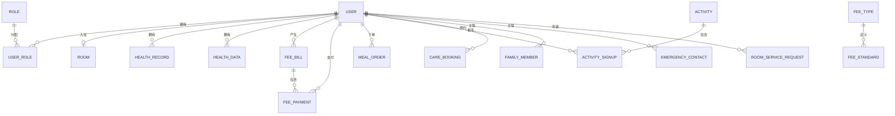

# 养老院公寓管理系统 - 数据库ER图

## 系统概述

本系统是一个综合性的养老院公寓管理平台，包含住客管理、健康管理、费用管理、餐饮管理、活动管理等多个模块。

## 核心实体关系图

## 实体详细说明

### 1. 用户管理模块

#### 用户表 (user)
| 字段 | 类型 | 说明 |
|------|------|------|
| id | INT | 主键 |
| username | VARCHAR(50) | 用户名 |
| real_name | VARCHAR(50) | 真实姓名 |
| user_type | INT | 用户类型：1-管理员，2-住客，3-护工 |
| room_id | INT | 房间ID（外键）|
| health_status | VARCHAR(20) | 健康状态 |
| balance | DECIMAL(10,2) | 账户余额 |

#### 角色表 (role)
| 字段 | 类型 | 说明 |
|------|------|------|
| id | INT | 主键 |
| role_name | VARCHAR(50) | 角色名称 |
| role_code | VARCHAR(50) | 角色编码 |

#### 用户角色关联表 (user_role)
| 字段 | 类型 | 说明 |
|------|------|------|
| id | INT | 主键 |
| user_id | INT | 用户ID（外键）|
| role_id | INT | 角色ID（外键）|

### 2. 房间管理模块

#### 房间表 (room)
| 字段 | 类型 | 说明 |
|------|------|------|
| id | INT | 主键 |
| room_number | VARCHAR(20) | 房间号 |
| room_type | VARCHAR(20) | 房间类型 |
| max_occupancy | INT | 最大入住人数 |
| current_occupancy | INT | 当前入住人数 |
| price | DECIMAL(10,2) | 房间价格 |
| status | INT | 状态：0-空闲，1-已入住，2-维修中 |

### 3. 健康管理模块

#### 健康档案表 (health_record)
| 字段 | 类型 | 说明 |
|------|------|------|
| id | INT | 主键 |
| elderly_id | INT | 住客ID（外键）|
| systolic_pressure | INT | 收缩压（高压）|
| diastolic_pressure | INT | 舒张压（低压）|
| blood_sugar | DECIMAL(4,2) | 血糖 mmol/L |
| heart_rate | INT | 心率 次/分钟 |
| temperature | DECIMAL(4,2) | 体温 ℃ |
| weight | DECIMAL(5,2) | 体重 kg |
| height | DECIMAL(5,2) | 身高 cm |
| blood_oxygen | INT | 血氧饱和度 % |
| health_status | INT | 健康状态：1-良好，2-一般，3-较差，4-危急 |
| medical_history | TEXT | 既往病史 |
| allergy_history | TEXT | 过敏史 |
| medication | TEXT | 用药记录 |
| diagnosis | TEXT | 诊断结果 |
| check_date | DATE | 检查日期 |
| doctor | VARCHAR(50) | 检查医生 |

#### 健康数据表 (health_data)
| 字段 | 类型 | 说明 |
|------|------|------|
| id | INT | 主键 |
| elderly_id | INT | 住客ID（外键）|
| record_type | INT | 记录类型：1-血压，2-血糖，3-体重，4-心率，5-体温，6-血氧，7-综合 |
| record_content | VARCHAR(255) | 记录内容摘要 |
| record_time | DATETIME | 记录时间 |

### 4. 费用管理模块

#### 费用类型表 (fee_type)
| 字段 | 类型 | 说明 |
|------|------|------|
| id | INT | 主键 |
| type_code | VARCHAR(50) | 类型编码 |
| type_name | VARCHAR(50) | 类型名称 |

#### 费用标准表 (fee_standard)
| 字段 | 类型 | 说明 |
|------|------|------|
| id | INT | 主键 |
| fee_type_id | INT | 费用类型ID（外键）|
| amount | DECIMAL(10,2) | 金额 |
| billing_cycle | VARCHAR(20) | 计费周期 |

#### 费用账单表 (fee_bill)
| 字段 | 类型 | 说明 |
|------|------|------|
| id | INT | 主键 |
| elderly_id | INT | 住客ID（外键）|
| bill_no | VARCHAR(50) | 账单编号 |
| total_amount | DECIMAL(10,2) | 总金额 |
| paid_amount | DECIMAL(10,2) | 已付金额 |
| status | INT | 状态：0-未支付，1-部分支付，2-已支付 |

#### 费用支付表 (fee_payment)
| 字段 | 类型 | 说明 |
|------|------|------|
| id | INT | 主键 |
| bill_id | INT | 账单ID（外键）|
| elderly_id | INT | 住客ID（外键）|
| amount | DECIMAL(10,2) | 支付金额 |
| payment_method | VARCHAR(20) | 支付方式 |

### 5. 餐饮管理模块

#### 菜品表 (meal_menu)
| 字段 | 类型 | 说明 |
|------|------|------|
| id | INT | 主键 |
| name | VARCHAR(100) | 菜品名称 |
| price | DECIMAL(10,2) | 价格 |
| meal_type | INT | 餐别：1-早餐，2-午餐，3-晚餐，4-加餐 |

#### 餐饮订单表 (meal_order)
| 字段 | 类型 | 说明 |
|------|------|------|
| id | INT | 主键 |
| elderly_id | INT | 住客ID（外键）|
| order_no | VARCHAR(50) | 订单编号 |
| total_amount | DECIMAL(10,2) | 总金额 |
| status | INT | 状态 |

### 6. 活动管理模块

#### 活动表 (activity)
| 字段 | 类型 | 说明 |
|------|------|------|
| id | INT | 主键 |
| title | VARCHAR(100) | 活动标题 |
| location | VARCHAR(100) | 活动地点 |
| start_time | DATETIME | 开始时间 |
| end_time | DATETIME | 结束时间 |
| max_participants | INT | 最大参与人数 |

#### 活动报名表 (activity_signup)
| 字段 | 类型 | 说明 |
|------|------|------|
| id | INT | 主键 |
| activity_id | INT | 活动ID（外键）|
| elderly_id | INT | 住客ID（外键）|
| status | INT | 状态：0-待审核，1-已通过，2-已拒绝 |

### 7. 护理管理模块

#### 护理预约表 (care_booking)
| 字段 | 类型 | 说明 |
|------|------|------|
| id | INT | 主键 |
| elderly_id | INT | 住客ID（外键）|
| nurse_id | INT | 护工ID（外键）|
| service_type | VARCHAR(50) | 服务类型 |
| booking_date | DATE | 预约日期 |
| amount | DECIMAL(10,2) | 金额 |
| status | INT | 状态 |

### 8. 家属管理模块

#### 家属表 (family_member)
| 字段 | 类型 | 说明 |
|------|------|------|
| id | INT | 主键 |
| elderly_id | INT | 住客ID（外键）|
| name | VARCHAR(50) | 姓名 |
| phone | VARCHAR(20) | 电话 |
| relation | VARCHAR(20) | 关系 |
| is_primary | INT | 是否主要联系人 |

### 9. 紧急联系人模块

#### 紧急联系人表 (emergency_contact)
| 字段 | 类型 | 说明 |
|------|------|------|
| id | INT | 主键 |
| elderly_id | INT | 住客ID（外键）|
| name | VARCHAR(50) | 姓名 |
| phone | VARCHAR(20) | 电话 |
| relation | VARCHAR(20) | 关系 |

## 数据库设计特点

1. **统一的用户模型**：使用 `user` 表统一管理所有用户，通过 `user_type` 区分不同类型
2. **逻辑删除**：所有表都有 `deleted` 字段，支持软删除
3. **时间戳**：所有表都有 `create_time` 和 `update_time` 字段
4. **外键关联**：使用外键保证数据完整性
5. **索引优化**：在常用查询字段上建立索引
